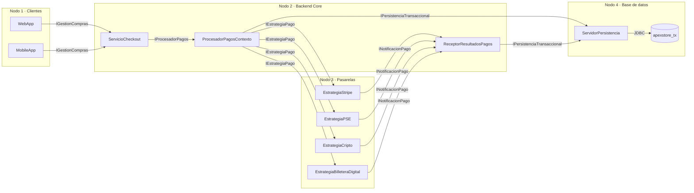
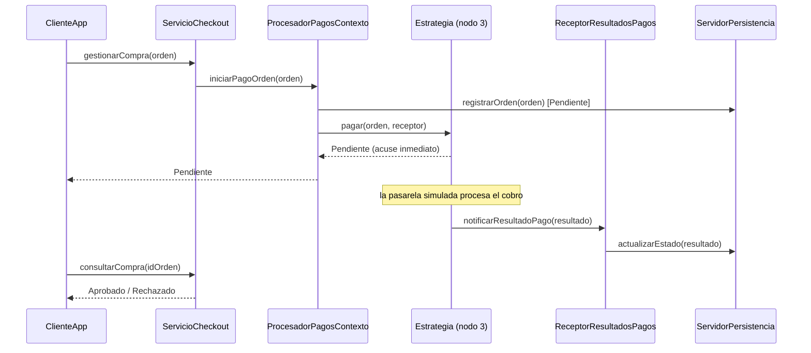
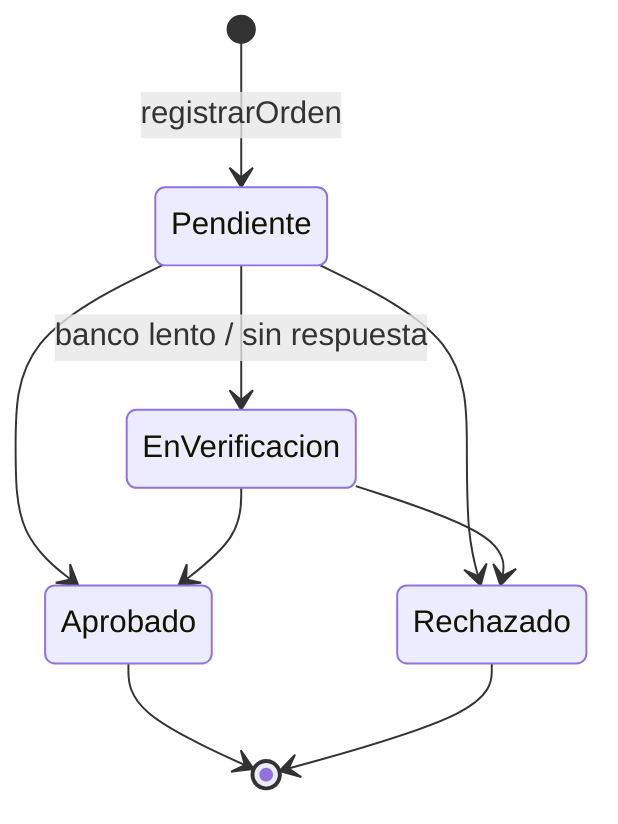

# ApexStore — Plataforma de pagos distribuida con ZeroC ICE

Tarea 1 de Ingeniería de Software IV (Universidad Icesi, 2026-2, NRC 10865).
Implementación en Java con ZeroC ICE del diagrama de despliegue corregido de ApexStore
(Punto 4 del enunciado).

**Equipo:** Danna Isabel Zambrano · Miguel Pérez

ApexStore es un comercio electrónico cuyo flujo de compra debe soportar picos de 8.000
peticiones por segundo sin que una pasarela de pago lenta bloquee el sistema, sin cobros dobles
ni pagos huérfanos, y permitiendo agregar medios de pago con mínimo impacto. El sistema está
dividido en cuatro nodos que se comunican únicamente a través de interfaces ICE.

> Las pasarelas de pago son **simuladas**: ningún componente se conecta a Stripe, a un banco ni
> a una red blockchain real.

---

## Contenido

1. [Arquitectura](#1-arquitectura)
2. [Cómo funciona un pago](#2-cómo-funciona-un-pago)
3. [Contrato ICE](#3-contrato-ice)
4. [Estructura del proyecto](#4-estructura-del-proyecto)
5. [Requisitos](#5-requisitos)
6. [Compilación](#6-compilación)
7. [Ejecución](#7-ejecución)
8. [Escenarios de prueba](#8-escenarios-de-prueba)
9. [Despliegue en varios equipos](#9-despliegue-en-varios-equipos)
10. [Configuración](#10-configuración)
11. [Agregar un medio de pago](#11-agregar-un-medio-de-pago)
12. [Solución de problemas](#12-solución-de-problemas)
13. [Documentación](#13-documentación)

---

## 1. Arquitectura

El diagrama de despliegue (UML 2.5) está en `docs/Diagrama_ApexStore_Corregido.vpp`
(Visual Paradigm). Cada nodo del diagrama es un programa independiente y cada artefacto es el
jar que se instala en ese nodo:

| Nodo | Artefacto | Puerto | Componentes |
|------|-----------|--------|-------------|
| Computador / Smartphone del Cliente | `cliente.jar` | — | WebApp y MobileApp (simuladas por `ClienteApp`) |
| Servidor E-Commerce (Backend Core) | `backend.jar` | 10002 | `ServicioCheckout`, `ProcesadorPagosContexto`, `ReceptorResultadosPagos` |
| Servidor de Pasarelas y Estrategias de Pago | `pagos.jar` | 10001 | `EstrategiaStripe`, `EstrategiaPSE`, `EstrategiaCripto`, `EstrategiaBilleteraDigital` |
| Servidor Base de Datos Transaccional | `persistencia.jar` | 10000 | `ServidorPersistencia` + esquema `apexstore_tx` (JDBC) |



Decisiones principales:

- **Fachada.** Los clientes solo conocen `IGestionCompras`; no saben que existen el procesador,
  las pasarelas ni la base de datos.
- **Patrón Strategy.** Las cuatro pasarelas implementan la misma interfaz `IEstrategiaPago`. El
  contexto elige la estrategia por el medio de la orden, consultando la configuración, y no conoce
  ningún detalle de cada medio: los datos de pago viajan como un token opaco.
- **Confirmación asíncrona.** `pagar` responde en milisegundos con un acuse; el resultado real
  llega después por `INotificacionPago`. Ningún hilo del backend espera al banco.
- **Sin dependencias circulares.** El callback lo recibe un componente aparte
  (`ReceptorResultadosPagos`): contexto → estrategias → receptor → persistencia.
- **Integridad (ACID).** Toda escritura pasa por la persistencia en transacciones JDBC, con
  control de transiciones de estado y una tabla de auditoría.
- **Backend sin estado.** El backend no guarda pagos en memoria, de modo que se puede replicar.

La relación detallada entre el diagrama, el código y los requerimientos (RAS-01 a RAS-04) está en
[docs/ARQUITECTURA.md](docs/ARQUITECTURA.md).

## 2. Cómo funciona un pago



1. El cliente envía la orden a `ServicioCheckout`, que valida los datos básicos.
2. `ProcesadorPagosContexto` busca la estrategia del medio y **registra la orden antes de cobrar**,
   para que nunca exista un cobro sin orden. Si la orden ya existía (el usuario pagó dos veces),
   devuelve su estado actual sin volver a cobrar.
3. El contexto llama `pagar` con un tiempo máximo de 2 s. La estrategia valida el token, deja el
   cobro en su propio grupo de hilos y responde `Pendiente`.
4. Cuando la pasarela responde, la estrategia notifica el resultado al receptor, que lo guarda.
   Si la notificación falla, se reintenta hasta 3 veces (es idempotente).
5. El cliente consulta el estado hasta obtener un resultado final.

### Estados de un pago



`EnVerificacion` se usa cuando no se sabe si el dinero se movió (por ejemplo, la pasarela no
respondió a tiempo). Un pago así no se marca como fallido, porque pudo haberse cobrado. La base
de datos rechaza cualquier otra transición: un pago aprobado nunca vuelve a pendiente.

### Tolerancia a fallos

| Situación | Comportamiento |
|-----------|----------------|
| Pasarela apagada (sin conexión) | La orden se rechaza: es seguro porque el cobro nunca llegó a la pasarela. |
| Pasarela que no responde en 2 s | El pago queda `EnVerificacion`; cuando la pasarela notifica, pasa a su estado final. |
| 3 fallos seguidos del mismo medio | Se abre el circuit breaker de ese medio durante 15 s y se responde de inmediato. Los demás medios no se ven afectados. |
| Base de datos caída | La orden se rechaza **antes** de intentar el cobro. |
| Notificación perdida | La estrategia la reintenta hasta 3 veces. |
| Orden enviada dos veces | Se registra y se cobra una sola vez. |

## 3. Contrato ICE

Definido en [`slice/ApexStore.ice`](slice/ApexStore.ice). Las cinco interfaces son las interfaces
provistas del diagrama:

| Interfaz | Provista por | Operaciones |
|----------|--------------|-------------|
| `IGestionCompras` | ServicioCheckout | `gestionarCompra(orden)`, `consultarCompra(idOrden)` |
| `IProcesadorPagos` | ProcesadorPagosContexto | `iniciarPagoOrden(orden)`, `consultarEstado(idOrden)` |
| `IEstrategiaPago` | las cuatro estrategias | `pagar(orden, callback)` |
| `INotificacionPago` | ReceptorResultadosPagos | `notificarResultadoPago(resultado)` |
| `IPersistenciaTransaccional` | ServidorPersistencia | `registrarOrden(orden)`, `actualizarEstado(resultado)`, `consultarTransaccion(idOrden)` |

`OrdenPago` lleva el monto en la unidad mínima de la moneda (centavos, satoshis) para evitar
errores de redondeo, y `idOrden` funciona como clave de idempotencia.

## 4. Estructura del proyecto

```
.
├── build.gradle                 compilación, generación de Slice y un jar por nodo
├── config/                      configuración ICE de cada nodo
│   ├── backend.config
│   ├── cliente.config
│   ├── pagos.config
│   └── persistencia.config
├── docs/
│   ├── ARQUITECTURA.md          relación diagrama ↔ código ↔ requerimientos
│   ├── BITACORA_IAG.md
│   ├── Diagrama_ApexStore_Corregido.vpp
│   ├── Enunciado.pdf
│   ├── INGESOFT_IV_Zambrano_Perez.pdf
│   └── Tarea_1_Rubrica_Evaluacion.pdf
├── scripts/                     arranque de cada nodo, demo local y apagado
├── slice/ApexStore.ice          contrato ICE
└── src/main/
    ├── java/com/apexstore/
    │   ├── comun/               salida por consola compartida
    │   ├── cliente/             Nodo 1: ClienteApp
    │   ├── backend/             Nodo 2: ServidorECommerce y sus componentes
    │   ├── pagos/               Nodo 3: ServidorPasarelas y las estrategias
    │   └── persistencia/        Nodo 4: ServidorBaseDatos y ServidorPersistencia
    └── resources/com/apexstore/persistencia/esquema.sql
```

Las clases Java del contrato se generan en `build/generated/slice` y no se versionan.

## 5. Requisitos

| Herramienta | Versión | Comprobación |
|-------------|---------|--------------|
| Java (JDK) | 17 o superior | `java -version` |
| ZeroC ICE | 3.7 (`slice2java` en el PATH) | `slice2java --version` |
| Gradle | 8.x | `gradle --version` |

Gradle descarga el resto de dependencias (runtime de ICE, H2 y el driver de PostgreSQL), por lo
que la primera compilación necesita conexión a internet. No hace falta instalar una base de datos.

## 6. Compilación

```bash
gradle assemble
```

Genera las clases del contrato con `slice2java --compat` y deja en `build/libs/` un jar
ejecutable por nodo:

```
build/libs/persistencia.jar   build/libs/pagos.jar
build/libs/backend.jar        build/libs/cliente.jar
```

Cada jar incluye sus dependencias, así que para desplegar un nodo basta con copiar su jar y la
carpeta `config/`.

## 7. Ejecución

Los programas leen su configuración de `config/`, por eso se ejecutan desde la raíz del proyecto
(los scripts ya lo hacen).

### Opción A: demo completa en un equipo

```bash
scripts/demo-local.sh
```

Compila, inicia los tres servidores, ejecuta todos los escenarios del cliente y apaga los
servidores al terminar. Los registros de cada servidor quedan en `build/logs/`.

### Opción B: una terminal por nodo

Respetando este orden:

```bash
scripts/persistencia.sh      # terminal 1 · Nodo 4 (puerto 10000)
scripts/pagos.sh             # terminal 2 · Nodo 3 (puerto 10001)
scripts/backend.sh           # terminal 3 · Nodo 2 (puerto 10002)
scripts/cliente.sh           # terminal 4 · Nodo 1
```

Cada servidor se detiene con `Ctrl+C`, o todos a la vez con `scripts/detener.sh`.
Sin los scripts, el equivalente es `java -jar build/libs/<nodo>.jar`.

### Salida esperada

El cliente muestra la respuesta inmediata y cada cambio de estado:

```
== pse: pse por 45000000 COP ==
  respuesta (5 ms)     Pendiente       PSE-RECIBIDO                 Pago en proceso
  consulta             Pendiente       REGISTRADA                   Orden recibida
  consulta             EnVerificacion  PSE-VERIFICANDO              El banco aún no confirma el débito
  consulta             Aprobado        PSE-APROBADO                 El banco confirmó el débito
```

Y cada servidor registra lo que hace, con la hora y el componente:

```
20:41:47.303 [checkout    ] orden ORD-38CB6A20 de cliente-0042 por 45000000 COP con pse
20:41:47.307 [contexto    ] ORD-38CB6A20 via pse -> Pendiente en 4 ms
20:41:48.166 [receptor    ] ORD-38CB6A20 -> EnVerificacion (El banco aún no confirma el débito)
20:41:51.171 [receptor    ] ORD-38CB6A20 -> Aprobado (El banco confirmó el débito)
```

## 8. Escenarios de prueba

`scripts/cliente.sh` acepta uno o varios escenarios; sin argumentos los ejecuta todos.

| Escenario | Qué demuestra | Resultado esperado |
|-----------|---------------|--------------------|
| `stripe` | pago con tarjeta tokenizada | Pendiente → Aprobado |
| `pse` | banco que tarda en confirmar | Pendiente → EnVerificacion → Aprobado |
| `cripto` | pago en BTC | Pendiente → Aprobado |
| `billetera` | medio agregado después del diseño original | Pendiente → Aprobado |
| `rechazo` | tarjeta declinada por el emisor | Pendiente → Rechazado |
| `invalido` | tarjeta sin tokenizar | Rechazado de inmediato |
| `desconocido` | medio sin estrategia configurada | Rechazado (`MEDIO-NO-SOPORTADO`) |
| `duplicada` | la misma orden enviada dos veces | se cobra una sola vez |

Ejemplo: `scripts/cliente.sh pse duplicada`

**Pruebas de fallos:**

- *Pasarela caída:* detener `pagos.sh` y ejecutar `scripts/cliente.sh stripe stripe stripe stripe`.
  Las tres primeras se rechazan con `PASARELA-NO-DISPONIBLE` y la cuarta con
  `MEDIO-NO-DISPONIBLE`, porque el circuito de Stripe se abrió.
- *Base de datos caída:* detener `persistencia.sh` y ejecutar `scripts/cliente.sh stripe`. La orden
  se rechaza con `SIN-REGISTRO` y no se intenta el cobro.
- *Pasarela que no responde:* congelar el proceso de pagos con `kill -STOP <pid>`, ejecutar
  `scripts/cliente.sh stripe` y luego reanudarlo con `kill -CONT <pid>`. El pago queda
  `EnVerificacion` y después pasa a `Aprobado`.

### Datos de las pasarelas simuladas

El campo `datosPago` lo interpreta solo la estrategia de cada medio:

| Medio | Formato válido | Palabra para simular otro resultado |
|-------|----------------|-------------------------------------|
| `stripe` | `tok_...` | `rechazada` → tarjeta declinada |
| `pse` | `banco=...` | `demora` → en verificación; `rechazar` → débito rechazado |
| `cripto` | `wallet=...` | `congestion` → en verificación |
| `billetera` | `billetera=...` | `sin-saldo` → saldo insuficiente |

## 9. Despliegue en varios equipos

No hay que recompilar: solo se editan los archivos de `config/`. Ejemplo con la base de datos en
`192.168.1.20`, las pasarelas en `192.168.1.21` y el backend en `192.168.1.22`:

| Equipo | Archivo | Cambio |
|--------|---------|--------|
| Base de datos | `persistencia.config` | `Persistencia.Endpoints=tcp -h 192.168.1.20 -p 10000` |
| Pasarelas | `pagos.config` | `Pagos.Endpoints=tcp -h 192.168.1.21 -p 10001` |
| Backend | `backend.config` | `Backend.Endpoints=tcp -h 192.168.1.22 -p 10002`, `Persistencia.Proxy` con `192.168.1.20` y las cuatro líneas `Pagos.*.Proxy` con `192.168.1.21` |
| Cliente | `cliente.config` | `Checkout.Proxy=ServicioCheckout:tcp -h 192.168.1.22 -p 10002` |

Consideraciones:

- `Backend.Endpoints` debe tener la IP real del backend: las pasarelas usan esa dirección para
  enviar el resultado de cada pago.
- Los puertos 10000, 10001 y 10002 (TCP) deben estar abiertos en el firewall de cada equipo.
- El orden de arranque sigue siendo: base de datos, pasarelas, backend, cliente.

## 10. Configuración

| Propiedad | Archivo | Valor por defecto | Descripción |
|-----------|---------|-------------------|-------------|
| `Persistencia.Endpoints` | persistencia | `tcp -h 127.0.0.1 -p 10000` | dónde escucha el nodo 4 |
| `BaseDatos.Url` | persistencia | H2 en memoria (modo PostgreSQL) | URL JDBC de la base de datos |
| `BaseDatos.Usuario` / `BaseDatos.Clave` | persistencia | `sa` / vacía | credenciales JDBC |
| `Pagos.Endpoints` | pagos | `tcp -h 127.0.0.1 -p 10001` | dónde escucha el nodo 3 |
| `Backend.Endpoints` | backend | `tcp -h 127.0.0.1 -p 10002` | dónde escucha el nodo 2 |
| `Persistencia.Proxy` | backend | `Persistencia:tcp ... -p 10000` | ubicación del nodo 4 |
| `Pagos.<medio>.Proxy` | backend | una por medio | estrategia que atiende cada medio |
| `Pagos.TimeoutMs` | backend | `2000` | tiempo máximo para el acuse de una pasarela |
| `Pagos.FallosParaAbrirCircuito` | backend | `3` | fallos seguidos que abren el circuito |
| `Pagos.EsperaCircuitoMs` | backend | `15000` | tiempo que el circuito permanece abierto |
| `Checkout.Proxy` | cliente | `ServicioCheckout:tcp ... -p 10002` | ubicación del backend |

### Usar PostgreSQL

Por defecto se usa H2 en memoria con sintaxis de PostgreSQL (los datos se pierden al detener el
nodo). Para usar PostgreSQL:

```sql
CREATE DATABASE apexstore_tx;
CREATE USER apexstore WITH PASSWORD 'apexstore';
GRANT ALL PRIVILEGES ON DATABASE apexstore_tx TO apexstore;
```

y en `config/persistencia.config`:

```properties
BaseDatos.Url=jdbc:postgresql://localhost:5432/apexstore_tx
BaseDatos.Usuario=apexstore
BaseDatos.Clave=apexstore
```

Las tablas `transaccion` y `auditoria` se crean al iniciar el nodo. Los datos del medio de pago
(tokens, cuentas, wallets) nunca se guardan.

## 11. Agregar un medio de pago

1. Crear la clase en `src/main/java/com/apexstore/pagos/` extendiendo `EstrategiaPagoBase` e
   implementar `validar`, `cobrar` y `latenciaSimulada`.
2. Agregar una instancia a la lista de `ServidorPasarelas`.
3. Agregar en `config/backend.config`:
   `Pagos.<medio>.Proxy=<NombreDeLaClase>:tcp -h 127.0.0.1 -p 10001`

No se modifican el contexto, las demás estrategias ni el contrato Slice. Así se agregó
`EstrategiaBilleteraDigital`.

## 12. Solución de problemas

| Síntoma | Causa probable |
|---------|----------------|
| `No hay conexión con el backend` | el backend no está corriendo o `Checkout.Proxy` tiene otra IP |
| `SIN-REGISTRO` en todas las órdenes | el nodo de persistencia no está corriendo |
| `PASARELA-NO-DISPONIBLE` | el nodo de pagos no está corriendo o `Pagos.*.Proxy` apunta a otra IP |
| `Address already in use` al iniciar un nodo | ya hay una instancia corriendo; usar `scripts/detener.sh` |
| `slice2java: command not found` | ICE 3.7 no está instalado o no está en el PATH |
| Los pagos se quedan en `Pendiente` en varios equipos | `Backend.Endpoints` tiene `127.0.0.1` y las pasarelas no pueden devolver el resultado |

## 13. Documentación

- [docs/ARQUITECTURA.md](docs/ARQUITECTURA.md): diagrama ↔ código, correcciones y requerimientos.
- `docs/Diagrama_ApexStore_Corregido.vpp`: diagrama de despliegue y componentes (Visual Paradigm).
- `docs/INGESOFT_IV_Zambrano_Perez.pdf`: informe de la tarea.
- `docs/Enunciado.pdf` y `docs/Tarea_1_Rubrica_Evaluacion.pdf`: enunciado y rúbrica.
