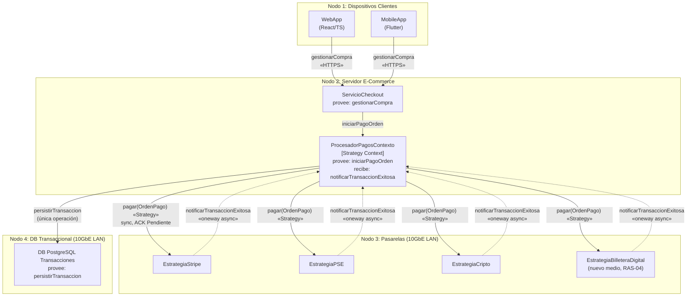

# Diagrama corregido — Punto 3 (referencia para Visual Paradigm)

Redibuje este modelo en Visual Paradigm como **diagrama de despliegue +
componentes UML 2.5** (igual notación que la Figura 1 del enunciado:
`Nodes`, interfaces provistas `◦` / requeridas `⊂`, protocolos en estereotipos).

## 1. Vista de despliegue (mermaid de referencia)

## 2. Tabla de elementos (para rotular en Visual Paradigm)

| Nodo | Componente | Interfaz provista ◦ | Interfaz requerida ⊂ | Notas vs. diagrama original |
|---|---|---|---|---|
| N1 | WebApp, MobileApp | — | `gestionarCompra` | Sin cambios (Dimensión 1) |
| N2 | ServicioCheckout | `gestionarCompra(OrdenPago): ResultadoPago` | `iniciarPagoOrden` | Sin cambios |
| N2 | ProcesadorPagosContexto | `iniciarPagoOrden(OrdenPago): ResultadoPago` | `pagar`, `persistirTransaccion` | Ahora también **recibe** `notificarTransaccionExitosa` (callback) |
| N2 | ProcesadorCallback (receptor) | `notificarTransaccionExitosa(ResultadoPago) «oneway»` | — | **Nuevo**: cierra el Punto 2d |
| N3 | EstrategiaStripe | `pagar(OrdenPago): ResultadoPago` | `notificarTransaccionExitosa` | Firma **unificada** (antes `autorizarCargoStripe(tokenTarjeta, montoUSD, cvcSeguridad)`) |
| N3 | EstrategiaPSE | `pagar(OrdenPago): ResultadoPago` | `notificarTransaccionExitosa` | Firma **unificada** (antes `debitarTransferenciaPSE(codigoBanco, tipoDoc, numCuenta, valorCOP)`) |
| N3 | EstrategiaCripto | `pagar(OrdenPago): ResultadoPago` | `notificarTransaccionExitosa` | Firma unificada **y se elimina** la flecha directa a DB (antes `persistirTransaccionExitosa`) |
| N3 | EstrategiaBilleteraDigital | `pagar(OrdenPago): ResultadoPago` | `notificarTransaccionExitosa` | **Nueva**: demuestra OCP/RAS-04 |
| N4 | DB PostgreSQL | `persistirTransaccion(resultado, orden)` + `consultarTransaccion` | — | **Una sola** operación de escritura (antes dos) |

## 3. Reglas visuales del rediseño

1. Las 4 estrategias exponen **el mismo lollipop** `pagar(OrdenPago)` (Strategy).
2. **No existe** flecha `Estrategia → DB`. Toda escritura pasa por el contexto.
3. Los callbacks se dibujan con **línea punteada + estereotipo `«async, oneway»`**.
4. `OrdenPago.datosPago` es opaco (ocultamiento de información): cada estrategia
   interpreta su formato (`tok_…`, `banco=…`, `wallet=…`).
5. Protocolos: `«HTTPS/Internet»` N1→N2, `«10GbE LAN»` N2↔N3↔N4 (PCI-DSS, Punto 2f).
